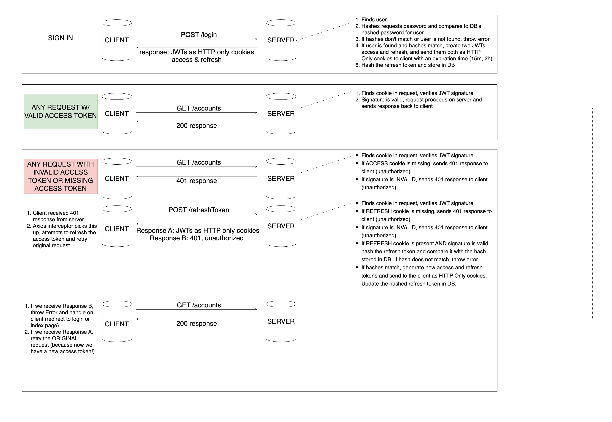

# NextJS + NestJS Auth!



## Run this app locally
* Provision a new Postgres Database on your local machine
* Create a .env file inside the server folder, use the .env.example
* Clone or fork [this repository](https://github.com/n-ochs/next-nest-auth-flow) and run the following commands:

Install Dependencies and Create DB Tables:
```
cd client
yarn install
cd ..
cd server
yarn install
yarn prisma migrate dev --name init
```

Run the app (two terminals):

1.
```
cd client
yarn dev
```
2.
```
cd server
yarn start:dev
```

Finally, create an account.

## Contributors
* [Nick Ochs](https://github.com/n-ochs)